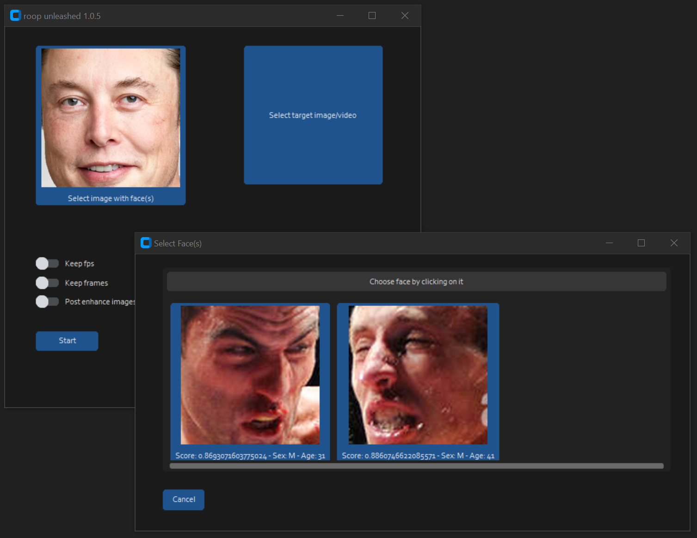

# roop-unleashed

[Changelog](#changelog) • [Installation](#installation) • [Usage](#usage) • [Example](#example-input) • [FAQ](#faq)


Uncensored face-swapping for images and videos without training with an easy-to-use GUI.  
Based on [roop](https://github.com/s0md3v/roop)

### Additional Features

- Uncensored
- Better GUI
- Selecting of specific faces in source/target possible
- Dynamic face enhancement toggle

## Disclaimer

This software is meant to be a productive contribution to the rapidly growing AI-generated media industry. It will help artists with tasks such as animating a custom character or using the character as a model for clothing etc.

Users of this software are expected to use this software responsibly while abiding the local law. If a face of a real person is being used, users are suggested to get consent from the concerned person and clearly mention that it is a deepfake when posting content online. Developers of this software will not be responsible for actions of end-users.


### Installation

For Windows, just use the 1-click installer in releases. This will download and install everything
in a handy conda environment. This not only installs the application but also runs it, once installed.
To enable your GPU however, you need to add the commandline argument to your windows_run.bat e.g.

> REM Please set the following commandline arguments to your prefered settings
set COMMANDLINE_ARGS=--execution-provider cuda --frame-processor face_swapper face_enhancer --video-encoder libvpx-vp9

This would set acceleration to NVIDIA Cuda, enable swapping and enhancements and use the latest video encoder. Please look below for an overview of possible commandline arguments.

 

For other OS or if you'd rather like to do this by yourself then:

- `git clone https://github.com/C0untFloyd/roop-unleashed`
- `pip install -r requirements.txt`

Depending on your system and available GPU there are different packages you need to install and different commandline args. Here are the instructions from the original roop page:

[Using GPU Acceleration](https://github.com/s0md3v/roop/wiki/2.-Acceleration)

For Video face-swapping you also need to have ffmpeg properly installed (having it in your PATH Env). The windows installer tries to do this automatically.  


### Usage

- Run the `windows_run.bat` from the Installer. Edit the .bat file to add your desired commandline arguments 
- Linux `python run.py (and optional commandline arguments)`

Additional command line arguments are given below. To find out what they do, check [this guide](https://github.com/s0md3v/roop/wiki/Advanced-Options).

```
options:
  -h, --help                                               show this help message and exit
  -s SOURCE_PATH, --source SOURCE_PATH                     select an source image
  -t TARGET_PATH, --target TARGET_PATH                     select an target image or video
  -o OUTPUT_PATH, --output OUTPUT_PATH                     select output file or directory
  --frame-processor FRAME_PROCESSOR [FRAME_PROCESSOR ...]  frame processors (choices: face_swapper, face_enhancer, ...)
  --keep-fps                                               keep original fps
  --keep-audio                                             keep original audio
  --keep-frames                                            keep temporary frames
  --many-faces                                             process every face
  --video-encoder {libx264,libx265,libvpx-vp9}             adjust output video encoder
  --video-quality [0-51]                                   adjust output video quality
  --max-memory MAX_MEMORY                                  maximum amount of RAM in GB
  --execution-provider {cpu} [{cpu} ...]                   available execution provider (choices: cpu, ...)
  --execution-threads EXECUTION_THREADS                    number of execution threads
  -v, --version                                            show program's version number and exit
```

Looking for a CLI mode? Using the -s/--source argument will make the run program in cli mode.

> Note: When you run this program for the first time, it will download some models ~300MB in size.


### Example

Let's assume we want to swap the faces in this image

to the faces of a person looking like Elon Musk and a person looking similar to Zuckerberg.
Selecting a source image with a face of Musk and using the originalimage from above as target, there will be a face-selection dialogue, looking like this:


After clicking on the face of your choice, this will be remembered and clicking on Start, specifying the output filename will begin the swapping process.  
When this is finished you view the resulting image/video by clicking on Show Result.

After additionally swapping a face looking like Zuckerberg onto the right dude, my final result looks like this:


It's almost the same procedure with videos but for the face selection you need to specify the frame number where your target face is visible (default: 1).


Image Credits: Alamy, Wikipedia, Imago

### FAQ

### Changelog

**24.06.2023** Initial Public Release 1.1.0


