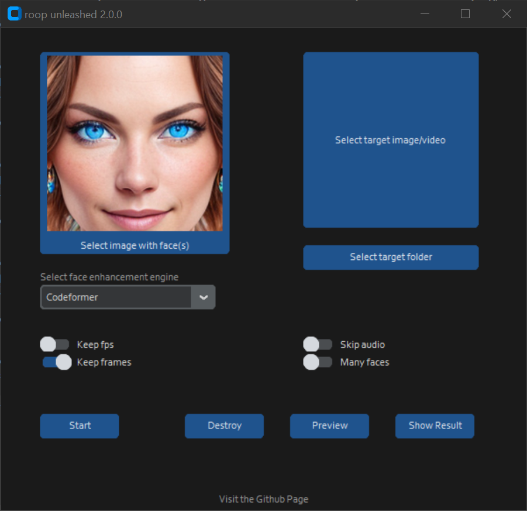

# roop-unleashed

[Changelog](#changelog) • [Installation](#installation) • [Usage](#usage) • [Example](#example) • [FAQ](#faq)

Uncensored Deepfakes for images and videos without training and an easy-to-use GUI.

### Features

- Platform-independant Browser GUI
- Selection of multiple input/output faces in one go
- Many different swapping modes, first detected, face selections, by gender
- Batch processing of images/videos
- Masking of face occluders using text prompts
- Optional Face Restoration using different enhancers
- Preview swapping from different video frames
- Live Fake Cam using your webcam
- Extras Tab for cutting videos etc.
- Settings - storing configuration for next session
- Theme Support

and lots more...

## Disclaimer

This project is for technical and academic use only.
Users of this software are expected to use this software responsibly while abiding the local law. If a face of a real person is being used, users are suggested to get consent from the concerned person and clearly mention that it is a deepfake when posting content online. Developers of this software will not be responsible for actions of end-users.
**Please do not apply it to illegal and unethical scenarios.**

In the event of violation of the legal and ethical requirements of the user's country or region, this code repository is exempt from liability

### Installation

> For Windows, you need to download and install [Visual Studio](https://visualstudio.microsoft.com/de/downloads/) (in theory build-tools might work too but in my experience so far they don't). During the install, make sure to include the C++ package.

Besides that, just use the 1-click installer in releases. This will download and install everything
in a handy conda environment. This not only installs the application but also runs it, once installed.

For other OS or if you know what you're doing:

- `git clone https://github.com/C0untFloyd/roop-unleashed`
- preferably create a venv or conda environment
- `cd roop-unleashed`
- `pip install -r requirements.txt`

Depending on your available GPU there are additional packages you need to install. Here are the instructions from the original roop page:

[Using GPU Acceleration](https://github.com/s0md3v/roop/wiki/2.-Acceleration)

The used GPU Provider is configured in the settings tab, no need to use cmdline arguments any more. Default is CUDA (for NVIDIA). If you change it, please restart roop-unleashed completely to allow for model reloading.

For Video face-swapping you also need to have ffmpeg properly installed (having it in your PATH Env). The windows installer tries to do this automatically.  

### Usage

- Windows: run the `windows_run.bat` from the Installer.
- Linux: `python run.py`

  

Additional commandline arguments are currently unsupported and settings should be done via the UI.

> Note: When you run this program for the first time, it will download some models roughly ~2Gb in size.

### Example

*Coming soon*

### Changelog

**11.8.2023** v2.7.0

Initial Gradio Version - old TkInter Version now deprecated

- Re-added unified padding to face enhancers
- Fixed DMDNet for all resolutions
- Selecting target face now automatically switches swapping mode to selected
- GPU providers are correctly set using the GUI (needs restart currently)
- Local output folder can be opened from page
- Unfinished extras functions disabled for now
- Installer checks out specific commit, allowing to go back to first install
- Updated readme for new gradio version
- Updated Colab

# Acknowledgements

Lots of ideas, code or pre-trained models used from the following projects:

https://github.com/deepinsight/insightface
https://github.com/s0md3v/roop
https://github.com/AUTOMATIC1111/stable-diffusion-webui
https://github.com/Hillobar/Rope
https://github.com/janvarev/chain-img-processor
https://github.com/TencentARC/GFPGAN   
https://github.com/kadirnar/codeformer-pip
https://github.com/csxmli2016/DMDNet

Thanks to all developers!

